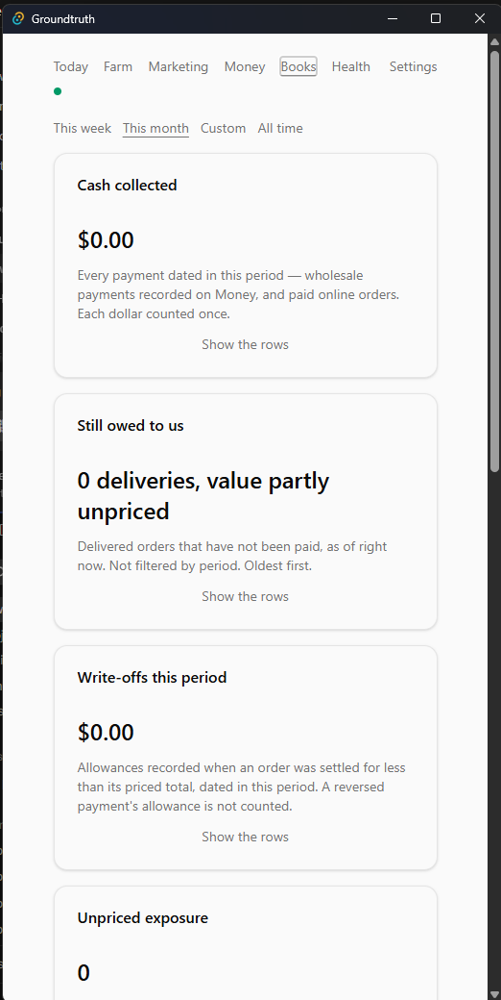
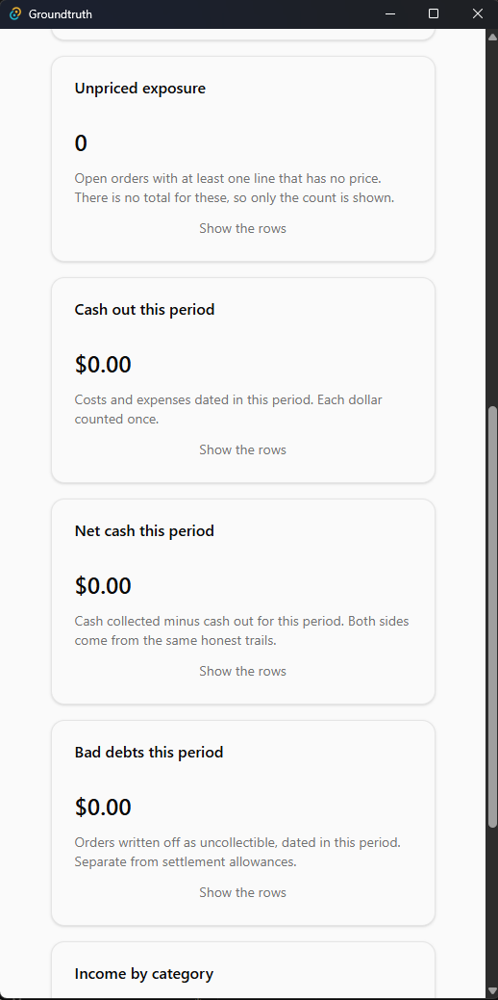
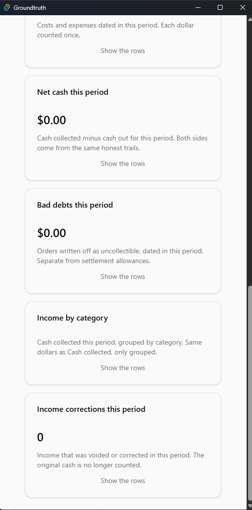

# Books

Books is a read-only lens on the one register. It is not a second
ledger and it is not a place to type money. Every door on this tab
writes nothing. The period switcher changes what you are looking at,
not what happened.

## If something is wrong

- Cash collected looks low but Money still shows the payment -> you
  are inside **This week** or **This month**. Switch to **All time**
  before you touch Money.
- Still owed to us ignores the period -> that card is as-of now,
  oldest first. Do not re-record a payment that is already on Money.
- Net cash is not "profit" -> it is cash collected minus cash out
  for the period you picked. Do not add miles or equipment into it.
- Unpriced exposure is a count, not a dollar -> there is no total
  for unpriced lines. Do not invent one in a spreadsheet.
- Write-offs and Bad debts are different cards -> an allowance on a
  short settle is not a bad debt. Do not treat them as one number.
- Income corrections this period is a count of voids and corrections
  -> the original cash is no longer in Cash collected. Do not add it
  back by hand.

## Doors on this tab

Period: **This week** · **This month** · **Custom** · **All time**.
Custom has **From** and **To**. All of them write nothing.

Nine cards. Each has **Show the rows**. That control writes nothing.

- **Cash collected**
- **Still owed to us**
- **Write-offs this period**
- **Unpriced exposure**
- **Cash out this period**
- **Net cash this period**
- **Bad debts this period**
- **Income by category**
- **Income corrections this period**

If a figure looks wrong, fix the row on Money. Then come back.

## Figures

