# Farm

Farm is the physical shelf: what is growing, what the phone proposed,
what the jar still holds. It is not the money register and it is not
the ranked queue. Forced collect and deliver live on Today. Confirm
is the only phone write; the phone itself writes nothing.

## If something is wrong

- The jar line and the sow you remember disagree -> read the muted
  jar lines under Records. Do not type a compensating **Record seed
  in**.
- Trays on the bench and trays on Farm disagree -> **Count the shelf**.
  Do not sow extra trays to "fix" a count.
- A phone row is accepted but still pending -> **Accept** is
  acknowledgement. Nothing is farm truth until **Confirm**.
- Pull failed and a refusal sentence is on the card -> read that
  sentence. Do not **Confirm** a row that is not on this list.
- Health names trays past harvest and Farm still shows them growing
  -> harvest from Today, or **Count the shelf** if they are already
  gone. Do not Dismiss that as if the trays had moved.
- Last backup is a dash -> snapshots live on this disk. Copy the
  farm folder yourself. Do not treat the automatic line as an off-box
  copy.

## Doors on this tab

- **Sow your first tray** / **Sow more trays** - `tray.sown` and
  `consumption.physical` on the sheet's **Sow**. Quantity **−** / **+**
  write nothing.

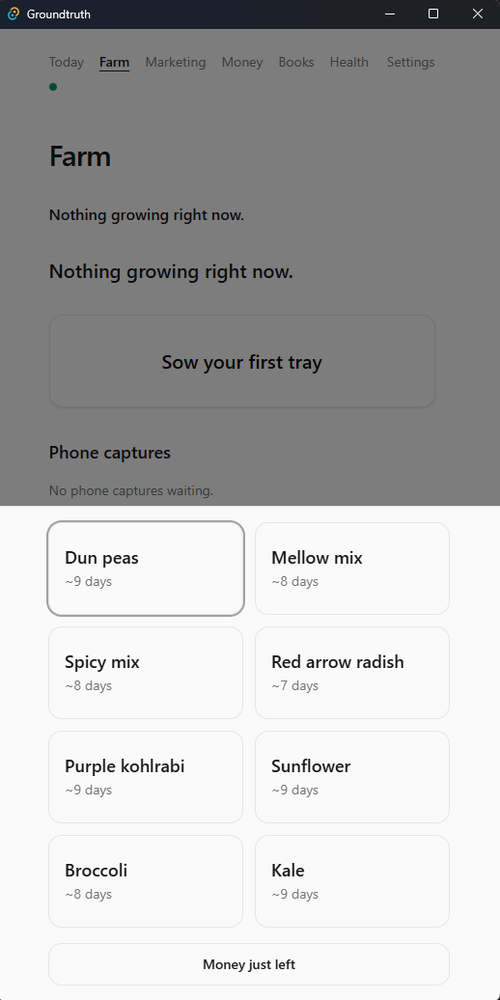

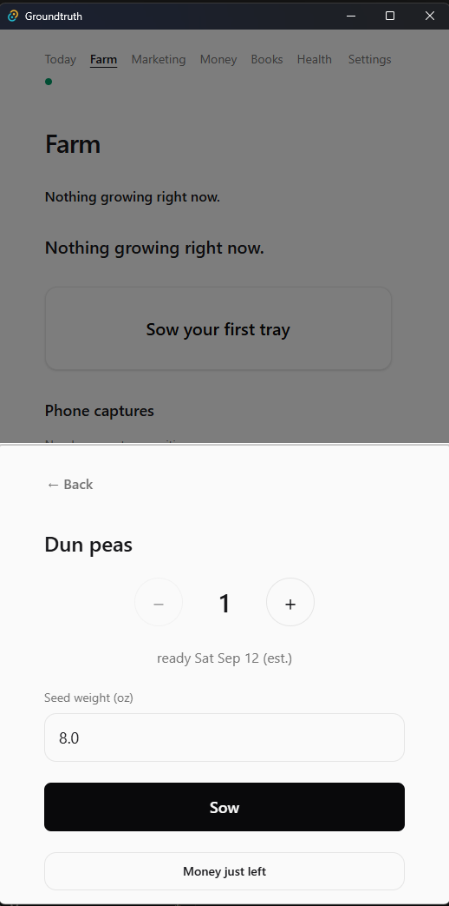

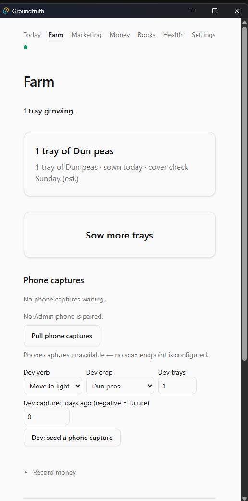

- **Move to light (N trays)** - writes nothing - discloses the next
  under-light lines. The write is **Move to light** on Today.
- **−** / **+** (phone-capture Edit) - writes nothing - draft only.
- **Accept** - writes nothing - marks the row for **Confirm**.
- **Edit** - writes nothing - shows the draft count and ounces.
- **Discard** - `phone.proposal_decided` - the proposal is refused.
- **Accept all** - writes nothing - Accept on every pending row.
- **Confirm** - `phone.proposal_decided` plus `trays.advanced` or
  `trays.harvested` - the gate. A blocked row stays pending with its
  sentence.
- **Pull phone captures** - `phone.proposed` for each new proposal
  the ingest accepts.
- **Undo** - `undo` - after a recount that changed the shelf, or
  after Dismiss.
- **Dismiss** - `attention.resolved`.
- **Count the shelf** - `recount.applied` on **Done** when the count
  disagrees; writes nothing when every crop matches.

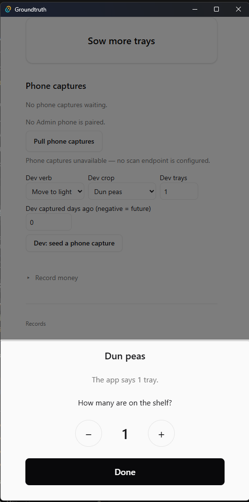

- **Crops** - writes nothing - name, days, and seed rate are
  reference data, not an event. **Save** and **Add a crop** stay on
  the crops table.

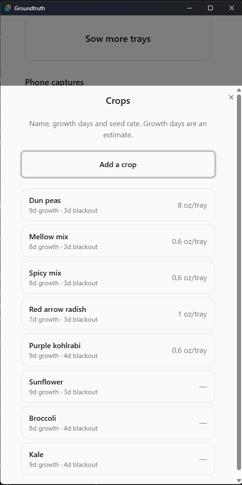

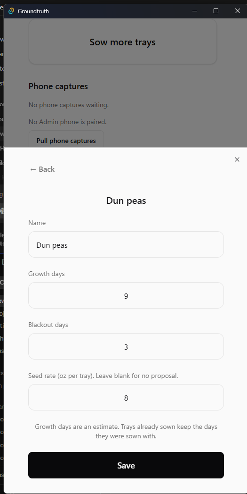

- **Record seed in** - `seed.received` on **Record**.

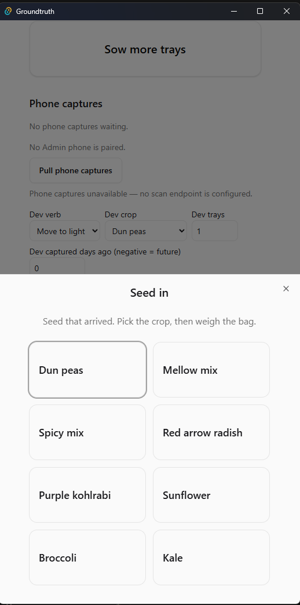

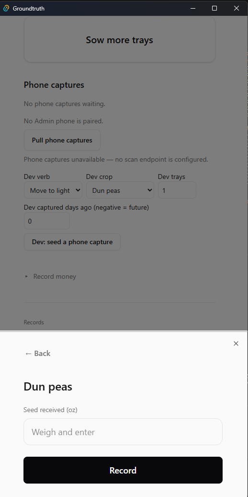

- **Record money** - the same six rows as Today.

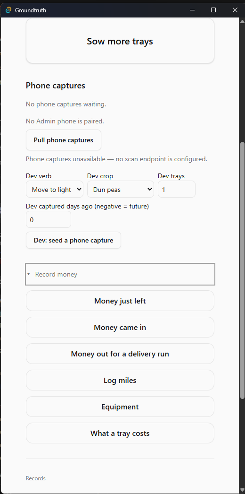

- **Farm saved automatically · last backup …** - writes nothing
  until you press a door inside Backup & Export. Snapshots are not a
  backup. See [integrity](integrity.md).
- **Dev: seed a phone capture** - `phone.proposed` - dev-only. Not
  on a release build.

## Figures

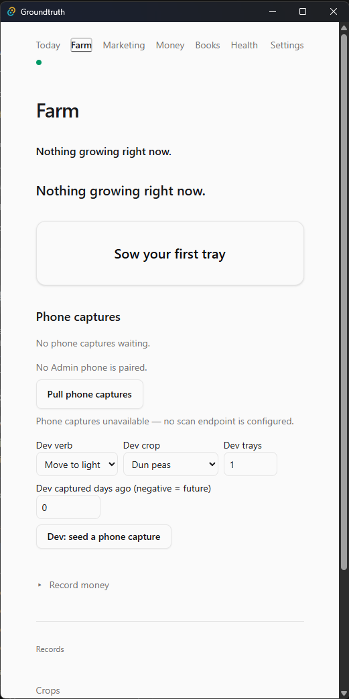

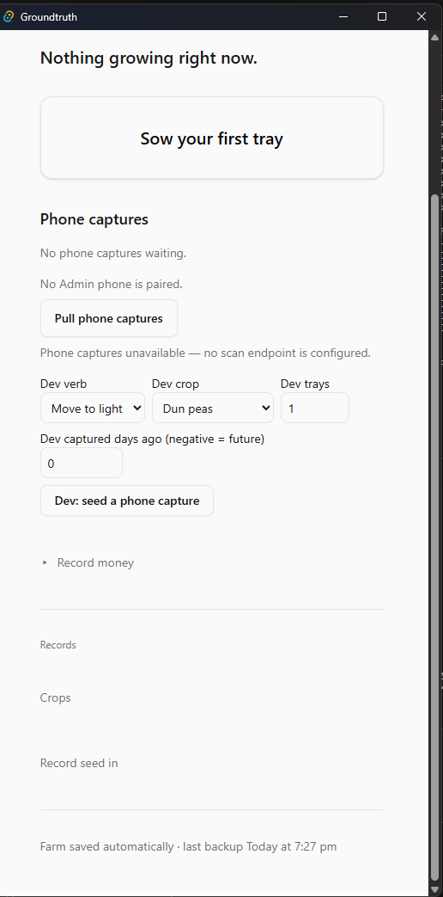
