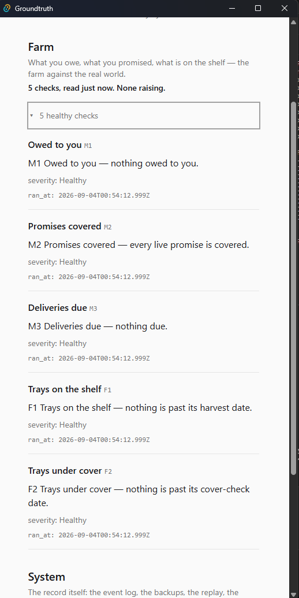
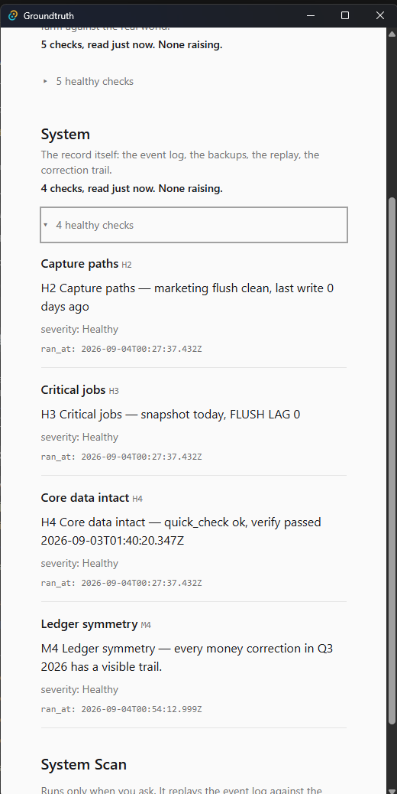
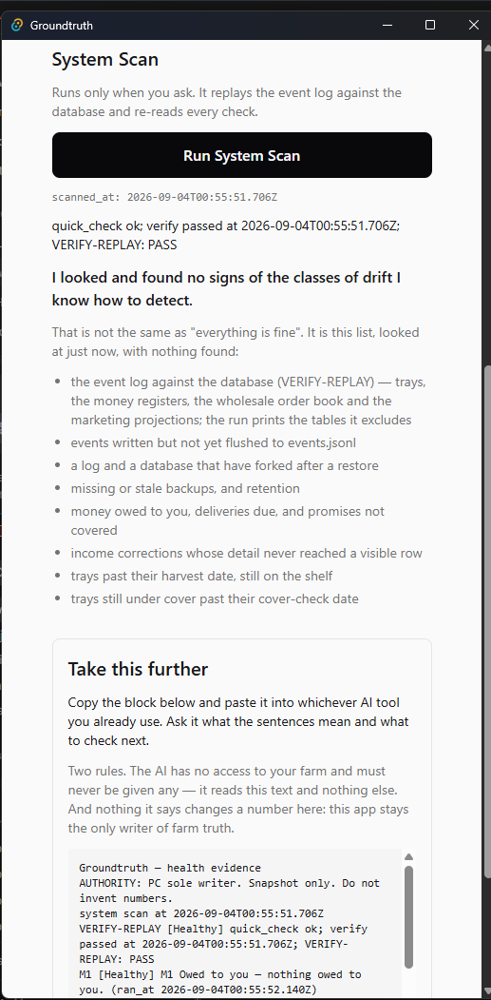
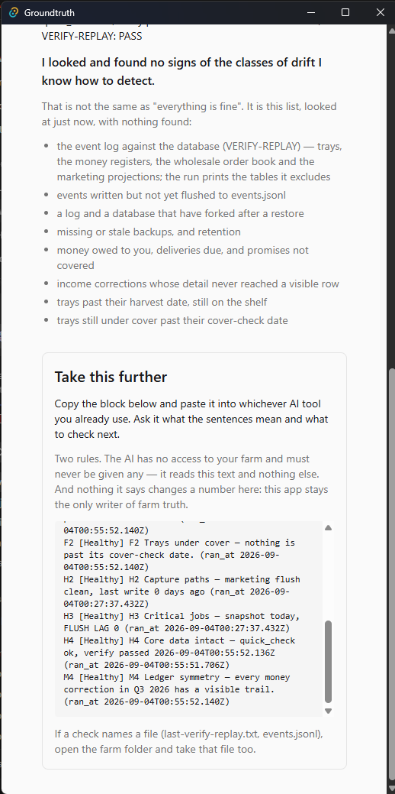
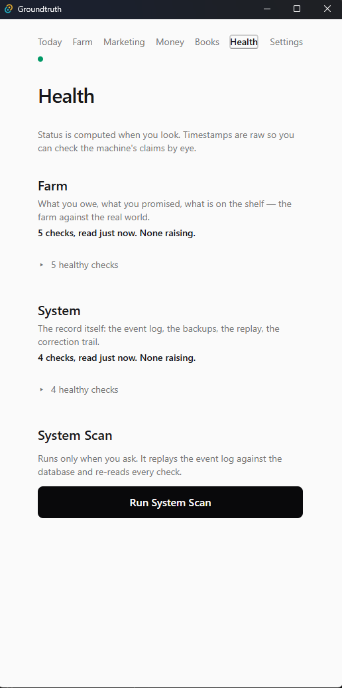

# Health

Health is the checks. It writes nothing. Status is computed when you
look. Green is not the goal; a true sentence is the goal. If this tab
disagrees with a number you remember, the check is the fact until you
follow its box.

Two scopes, titles and blurbs as printed:

- **Farm** — What you owe, what you promised, what is on the shelf —
  the farm against the real world.
- **System** — The record itself: the event log, the backups, the
  replay, the correction trail.

## If something is wrong

- A check is Unhealthy -> the red **Do this now** box is the next
  step. Do not record new events until it clears, when the box says
  so.
- A check is Degraded -> the **What to do** box is guidance, not
  panic. Do not run a second ledger "until it looks better".
- The sentence contains "could not read" -> the check confirmed no
  debt, tray, or log fact. Run **Run System Scan**. Do not invent
  the missing number.
- VERIFY-REPLAY fails -> open [integrity](integrity.md), then come
  back and follow that check's own recovery box. Do not hand-edit
  the database.
- Healthy checks are in the way -> they sit behind **N healthy
  checks**. Do not treat a Healthy sentence as work.

## Doors on this tab

A raising check prints: title, sentence, `severity`, `ran_at`, and
either **Do this now** (Unhealthy) or **What to do** (Degraded).
Those boxes write nothing. They name verbs that already exist on
other tabs.

- **N healthy checks** - writes nothing - discloses the Healthy
  rows for that scope.

- **Run System Scan** - writes nothing - replays the event log
  against the database and re-reads every check.

**Take this further** appears when a check is raising or a scan has
run. Two rules, as printed:

- The AI reads that text and nothing else.
- Nothing it says changes a number here.

Copy the block. Do not give the farm folder to a tool.

## Figures

