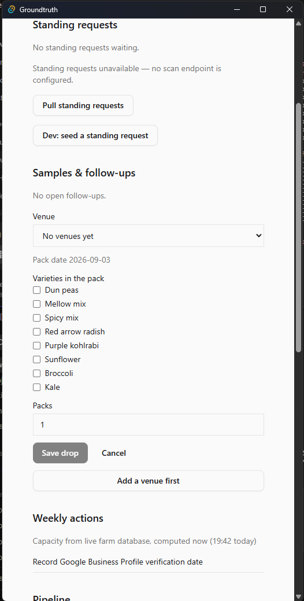
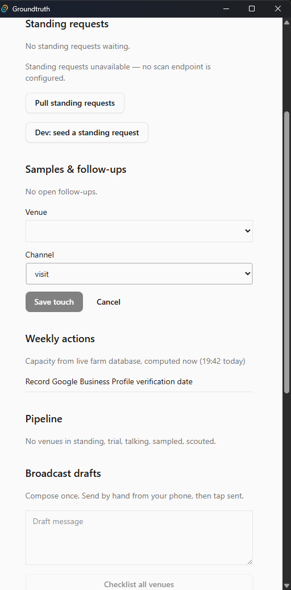
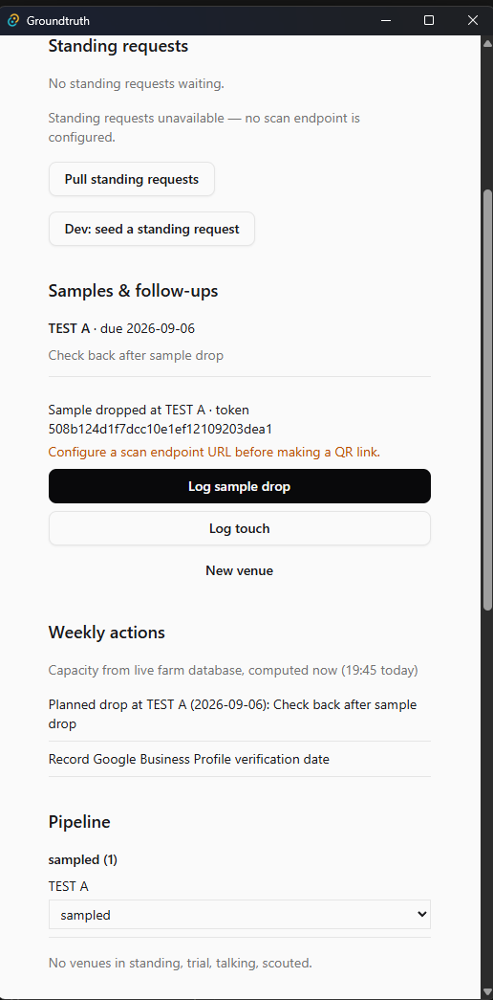
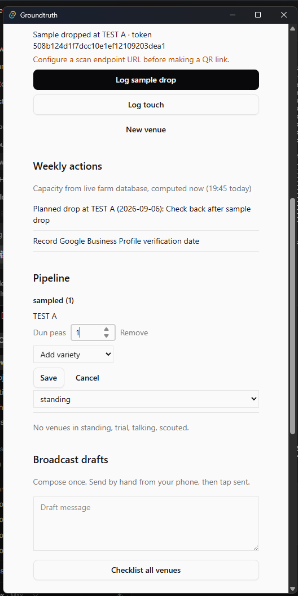
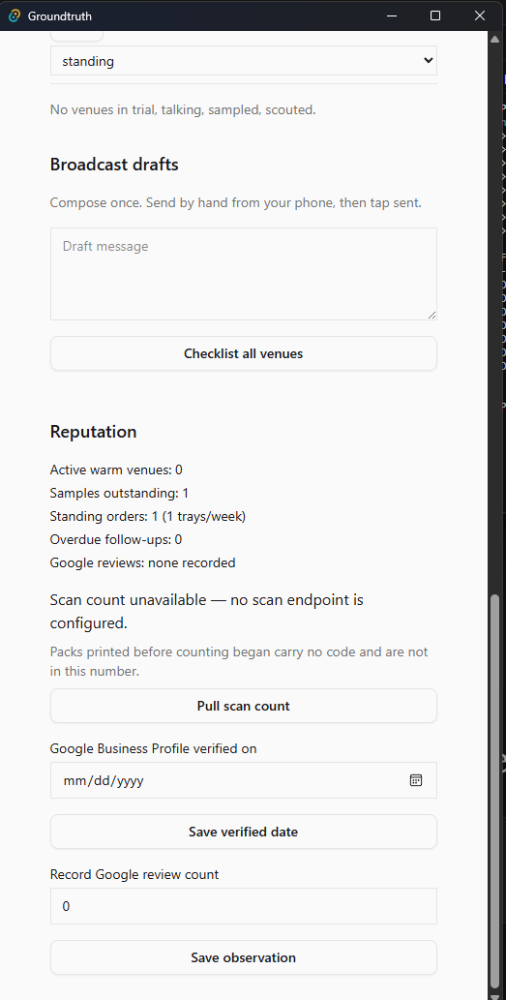
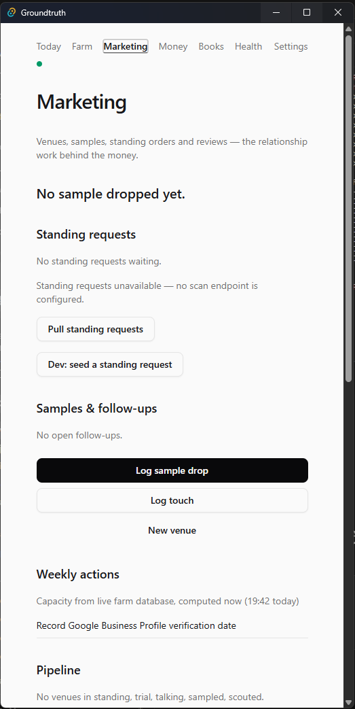
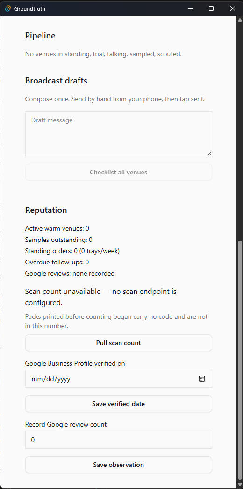

# Marketing

Marketing is the relationship work: venues, samples, standing, and
reviews. It is not money. A sample, a touch, or a conversation is
never a payment. Standing on this tab is a stage, not an order;
capacity still only moves when Money records a wholesale order or
when a paid link confirms.

## If something is wrong

- A standing request will not Accept -> the venue is not ready for a
  QR, or bags per cycle is below one. Do not invent a standing stage
  by hand to skip the refusal.
- Save drop is dead -> **Save venue details** first. Do not drop on
  an incomplete venue.
- Weekly actions still ask for a review you already asked -> Asked
  and Skip are once per venue. Do not press them twice.
- Pipeline standing has a total and no split -> **Save** after you
  re-state by variety. Do not sow from an unsplit total.
- Capacity line looks stale -> it is computed when you look. Do not
  treat it as a reserved tray.
- QR Copy failed -> the link is on screen; write it down. Do not
  type a host you remember from another machine.

## Doors on this tab

- **Log sample drop** - writes nothing - opens the drop form.
- **Log touch** - writes nothing - opens the touch form.
- **New venue** - writes nothing - opens the venue form.
- **Save venue** - `venue.recorded` then `stage.changed` (scouted).
- **Save venue details** - `venue.corrected`.
- **Save drop** - `sample.dropped` and `followup.set`; then
  `stage.changed` (sampled).
- **Save touch** - `touch.logged`.
- **Cancel** - writes nothing.
- **Add a venue first** - writes nothing - opens **New venue**.
- **Save** (standing targets) - `stage.changed` with trays/week split
  by variety.
- **Mark passed** / **Mark dormant** - `stage.changed` after the
  confirm. The stage select itself writes `stage.changed` for every
  other rung.
- **Cancel** (stage confirm, or pending standing) - writes nothing.
- **Accept** (standing request) - `standing.request_decided` and, if
  accepted, `stage.changed`.
- **Dismiss** (standing request) - `standing.request_decided`.
- **Pull standing requests** - `standing.requested` for each new
  candidate the ingest accepts.
- **Logged visit** - `touch.logged` and `followup.cleared`.
- **Weekly actions** - writes nothing - a list, not a door.
- **Pipeline** - the stage select and standing **Save** above.
- **Checklist all venues** - writes nothing - builds the send list.
- **Sent** - `touch.logged` (channel text).
- **Pull scan count** - writes nothing - a scan observation, not an
  event Kind.
- **Save verified date** - writes nothing - reference data on this
  machine.
- **Asked** / **Skip** - `review.requested` - once per venue.
- **Save observation** - `reviews.observed`.
- **Copy** (QR, after a drop) - writes nothing - clipboard.
- **Dev: seed a standing request** - `standing.requested` - dev-only.
  Not on a release build.

## Figures

