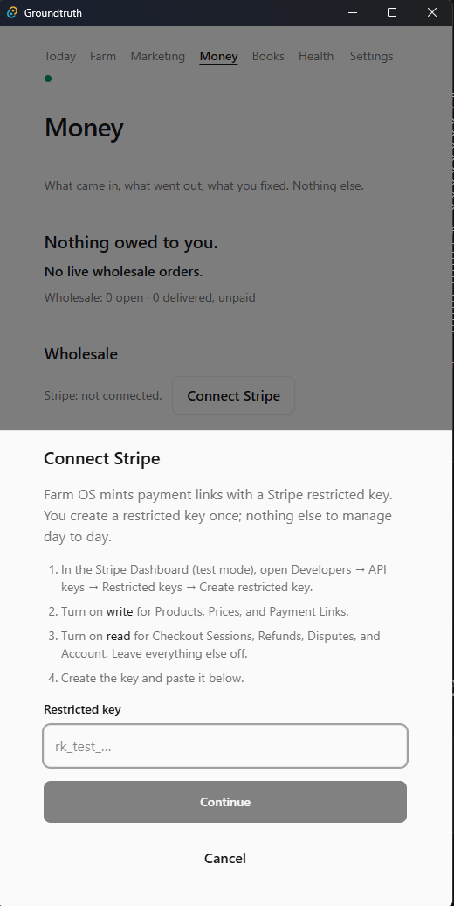
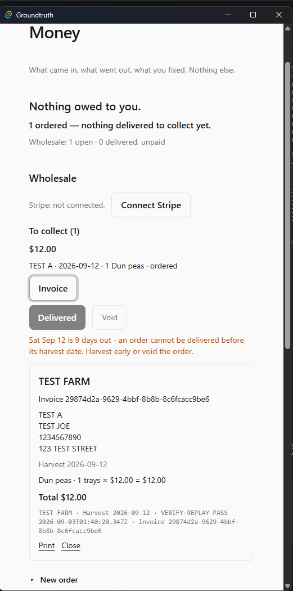
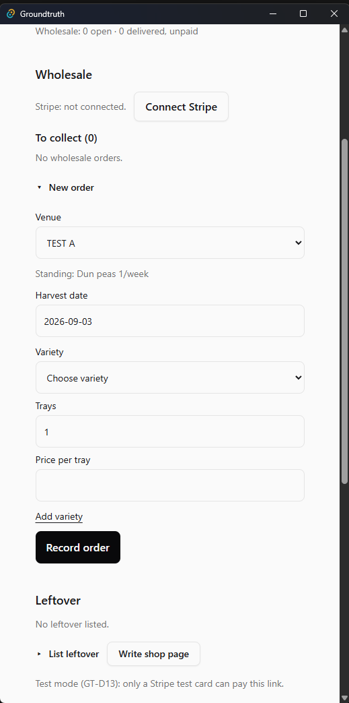
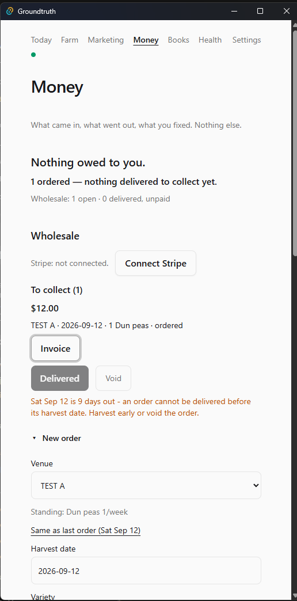
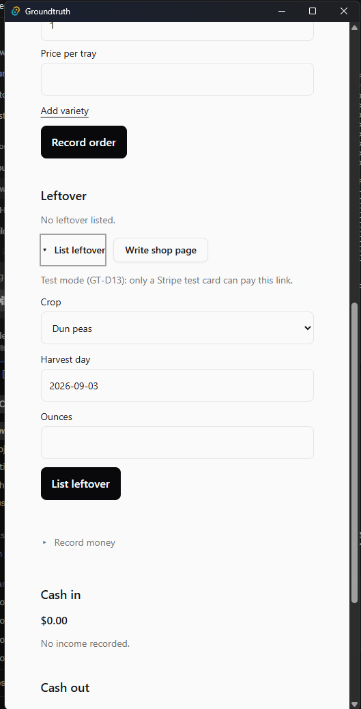
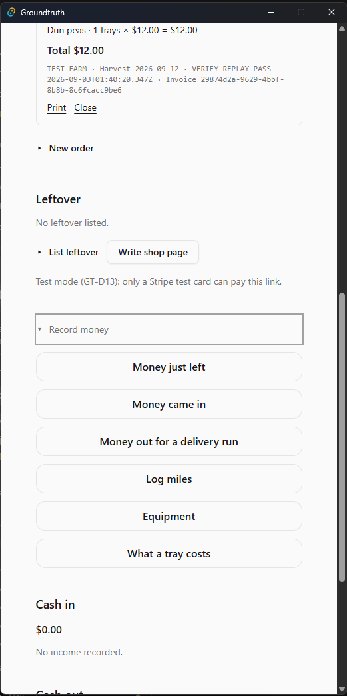
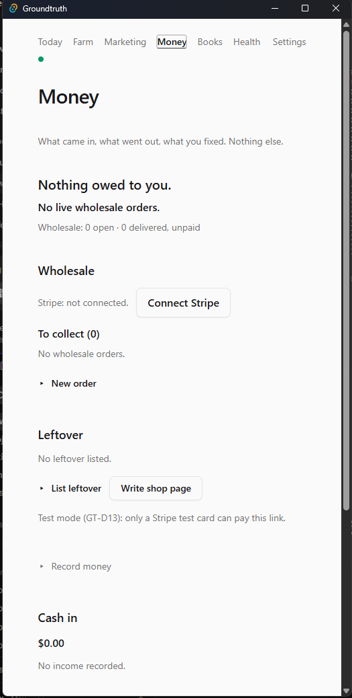
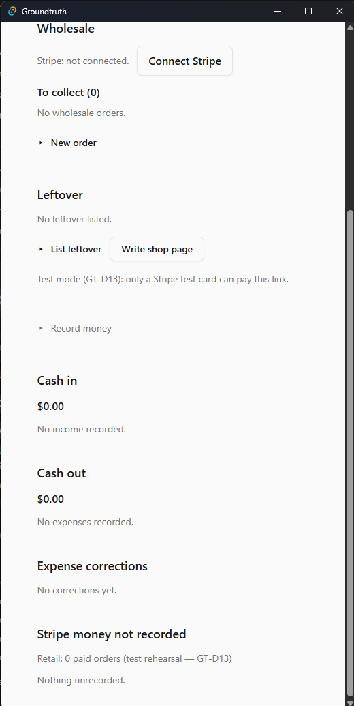

# Money

Money is the register: wholesale, leftover, cash in, cash out. It is
not Books (Books is a lens on this same register). Unpaid stays
unpaid. Unpriced stays unpriced. A payment link is not a payment.
Every figure here and every bill uses the farm currency set on
Settings - changing it converts nothing. Every new payment link
Groundtruth mints is billed in that currency. A link already minted
keeps the code it was minted in; Money prints that code on the link
line, and changing Settings does not rewrite an existing link. A row
with no readable mint code prints the bare label Payment link.

## If something is wrong

- Cash collected on Books is lower than you expect and Health is
  green -> you are in a period. Open **This week** / **This month**
  / **All time** on Books. Do not press **Paid…** again.
- Delivered is dead and a refusal sentence sits under the row ->
  read that sentence. Do not void the order to force a delivery.
- Paid… will not Save on an unpriced row -> price the lines first.
  Do not type a round number to skip the price.
- A Stripe fact sits under **Stripe money not recorded** -> nothing
  was applied. Use **Paid…** or **Reverse payment** as the sentence
  says. Do not invent a second income row to match it.
- Leftover List leftover refuses -> one listing per crop-day, and
  ounces cannot exceed that day's harvest. Do not list a second time.
- Connect Stripe Continue is dead -> the Restricted key field is
  empty. A test key or a live key is accepted; a live key moves
  real money.
- A Payment link refuses and names a currency -> Stripe will not take
  the farm currency on that account. Nothing was written. Change Farm
  currency on Settings or collect with **Paid…**.

## Doors on this tab

### Wholesale

- **Invoice** - writes nothing - opens the bill.
- **Delivered** - `wholesale.delivered`.
- **Void** then **Confirm void** - `wholesale.voided`.
- **Paid…** then **Save** / **Record anyway** - `income.received` and
  `wholesale.paid`; plus `wholesale.write_off` when you settle short.
- **Payment link** - `wholesale.link_minted` - mints the link in the
  farm currency and records that code. Moves no money.
- **Copy** - writes nothing.
- **Write off as bad debt** then **Write it off as bad debt** -
  `wholesale.bad_debt`. **Keep it owed** writes nothing.
- **Reverse payment** then **Reverse the payment** -
  `wholesale.payment_reversed`. **Keep it paid** writes nothing.
- **Back to Today** - writes nothing.

### To collect

Heading only. The converting taps are on the row.

### Connect Stripe / Replace key

Writes nothing. The key is config on this machine, not an event.

The sheet names the farm currency: every new payment link
Groundtruth mints is billed in it, and if Stripe refuses that
currency for the account the mint refuses and nothing is written. A
link already minted keeps the code it was minted in.

- **Continue** - preview only.
- **Connect this account** - stores the key.
- **Use a different key** / **Cancel** - writes nothing.

### Invoice bill

- **Print** / **Close** - writes nothing.
- **Copy bill** - writes nothing - the bill as text on the clipboard,
  Pay by: and Pay online: included when set.
- **Email bill** - writes nothing - opens your mail app with the bill
  as the body; you type the address.
- Under **Total**: **Pay by:** and the How to pay line from Settings,
  when one is saved. None saved, nothing printed. **Pay online:** and
  the link follow when a link exists.

### New order

- **Same as last order** - writes nothing - fills the draft.
- **From standing** - writes nothing - drafts this week's lines from
  the venue's standing; edit anything, then Record order writes.
- **Add variety** - writes nothing.
- **Record order** / **Record anyway** - `wholesale.ordered`.

### Leftover

- **List leftover** - `leftover.listed`.
- **Invoice** - writes nothing.
- **Payment link** - `leftover.link_minted`.
- **Paid…** then **Save** - `income.received` and `leftover.paid`.
- **Copy** - writes nothing.
- **Write shop page** - writes nothing - a file on disk, not an
  event. Shop remount is refused. See [refused](refused.md).
- **Open folder** - writes nothing.

### Cash in

- **Apply to an order…** then **Apply** / **Apply anyway** -
  `wholesale.paid`; plus `wholesale.write_off` when short. **Cancel**
  writes nothing.

### Cash out

- **Correct** then **Save correction** - `cost.money_out_corrected`.
- **Void** then **Void** on the sheet - `cost.money_out_voided`.

### Expense corrections

A trail. No door.

### Stripe money not recorded

A list of facts that did not apply. No door.

### Record money

The same six rows as Today.

## Figures

