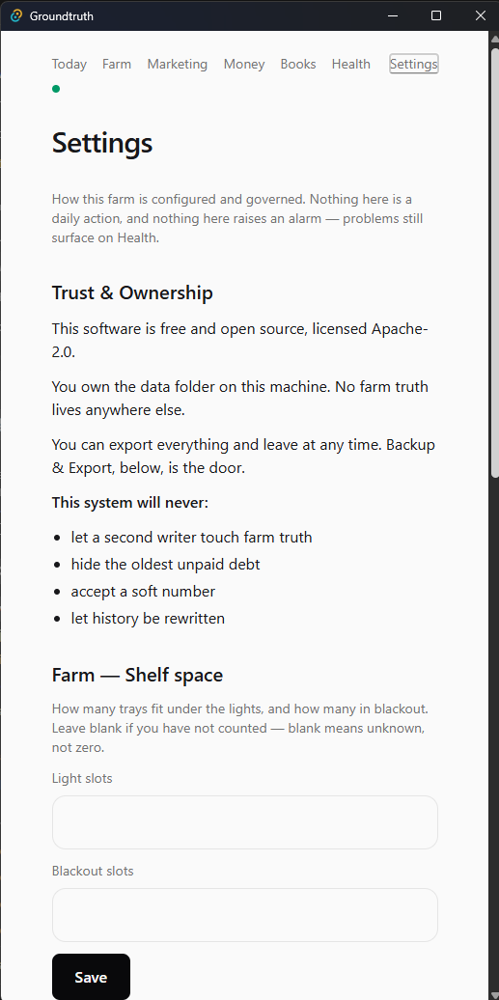

# Settings

Settings is how this farm is configured and governed. Nothing here
is a daily action and nothing here raises an alarm. Problems still
surface on Health. Most doors write nothing: they store reference
data outside the event log.

## If something is wrong

- Light slots or Blackout slots feel like zero after you cleared
  them -> blank means unknown, not zero. Do not type 0 unless the
  building has no room.
- The Admin phone cannot capture -> captures are confirmed on Farm.
  Pairing here does not make the phone a writer.
- Dock will not Start -> this machine is the sole writer. Do not
  turn on a second writer. TLS on the LAN dock is declined. See
  [refused](refused.md).
- Scan Save did nothing you can see -> a blank field means leave as
  is. Do not paste a host from memory.
- You cannot find the farm folder -> **Open Backup & Export**, then
  **Open folder**. Do not search another Windows user.
- Save how to pay refuses -> the line is longer than 120 characters,
  or it holds `rk_` or `sk_`. A Stripe key is not a pay instruction.
  Nothing was saved. Shorten the line or take the key out.
- You changed Farm currency and no total moved -> correct. The code
  changes; no number is converted. A link already minted keeps the
  currency it was minted in.
- You changed Units and a receipt reads 340 g where it read 12.0 oz ->
  correct. Same weight, printed in grams. Nothing was rewritten.

## Doors on this tab

### Trust & Ownership

Four lines, as printed. This system will never:

- let a second writer touch farm truth
- hide the oldest unpaid debt
- accept a soft number
- let history be rewritten

No door.

### Farm — Shelf space

- **Light slots** / **Blackout slots** then **Save** - writes
  nothing - shelf config. Blank means unknown, not zero.

### Field terminal

- **Pair the Admin phone** - writes nothing - pairing record on
  this machine.
- **Copy link** / **Copy token** - writes nothing - clipboard. The
  token is shown only while this pairing is live.
- **Retire the Admin phone** - writes nothing.
- **Mode: Solo** - not a control. Captures are confirmed on Farm.

### Dock

- **Start** / **Stop** - writes nothing - the local dock process.
  While running the card prints the address
  (`http://<this PC on your Wi-Fi>:18765`) and a QR of it; scan it on
  the phone. This address is not encrypted. Use it only on Wi-Fi you
  trust.

### Connections

- **Scan endpoint URL** - a field. Do not copy a host onto this
  page.
- **Pull token** - a field. Blank means leave as is. The page never
  re-shows a saved token.
- **Save** - writes nothing - scan config on this machine.

### Backup & Export

- **Open Backup & Export** - writes nothing until a door inside the
  sheet. Behind it: the farm folder and **Open folder**, the
  snapshots and **Restore**, **Bring in a bundle**, and **Export
  everything**. Restore refuses to merge two different farms.
  Snapshots are not a backup. See [integrity](integrity.md).

### Farm name

- **Save farm name** - writes nothing - printed at the top of every
  invoice. Reference data on this machine, not an event. Empty means
  invoices refuse to show.

### Farm currency
- **Farm currency** - writes nothing - farm config on this machine,
  not an event. Eight names, no others: US dollars (USD), Canadian
  dollars (CAD), Euros (EUR), British pounds (GBP), South African
  rand (ZAR), Indian rupees (INR), Kenyan shillings (KES), Thai
  baht (THB). The pick sets what bills, the owed line, Books and
  every new payment link speak. Changing it converts nothing - a
  12.50 stays 12.50. A link already minted keeps its own currency.

### Units
- **Units** - writes nothing - farm config on this machine, not an
  event. The units this desk prints weights in. Harvest receipts,
  yield per tray, seed and leftover lines use it. The books weigh in
  ounces and stay that way — changing this rewrites nothing. A
  harvest weighed at 12.0 oz stays 12.0 oz in the file and prints as
  340 g.

### How to pay
- **How to pay** then **Save how to pay** - writes nothing - farm
  config on this machine, not an event. One line in your own words -
  an M-Pesa till, a UPI ID, a PromptPay number, an IBAN, a PayShap
  ID - printed under the total on every bill. Empty saves nothing
  and prints nothing. Longer than 120 characters is refused. A line
  holding `rk_` or `sk_` is refused.

