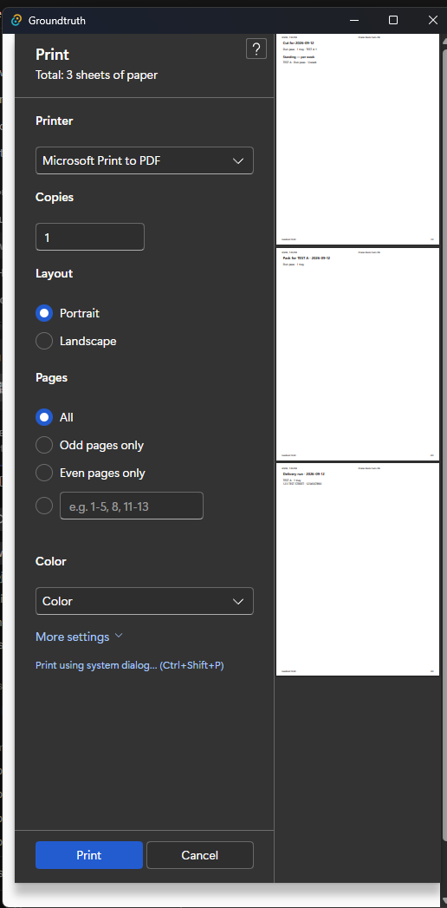
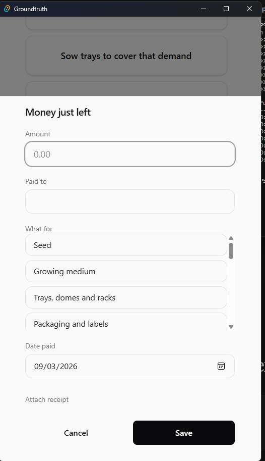
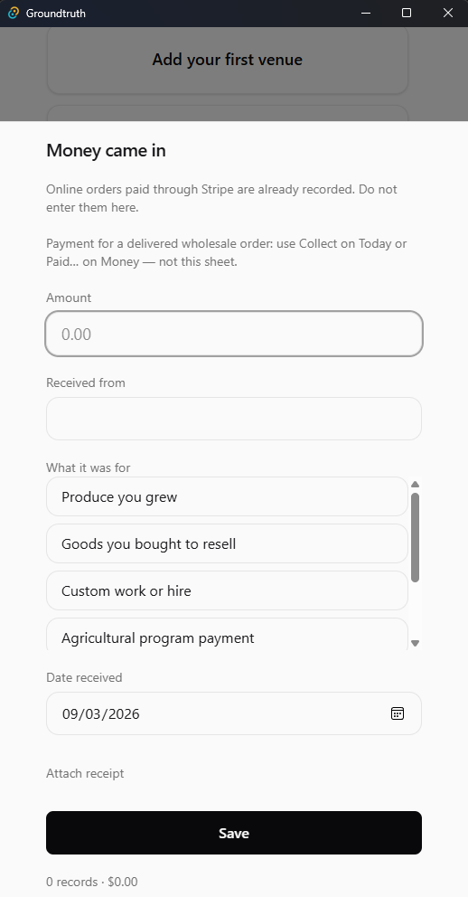
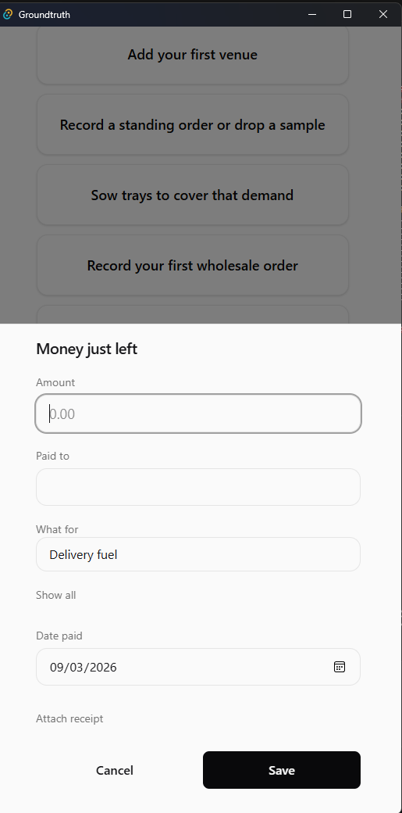
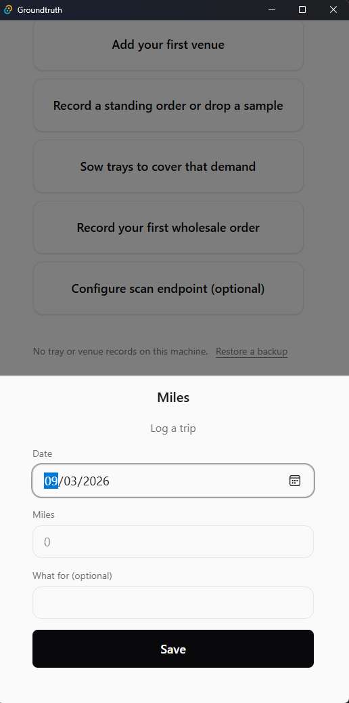
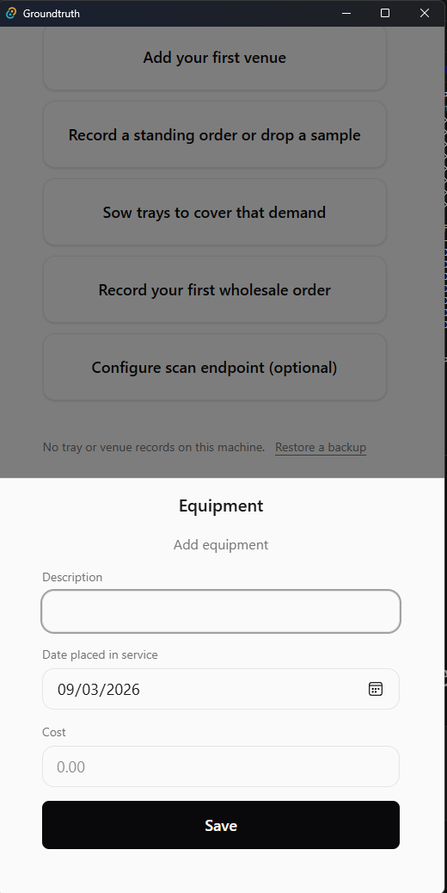
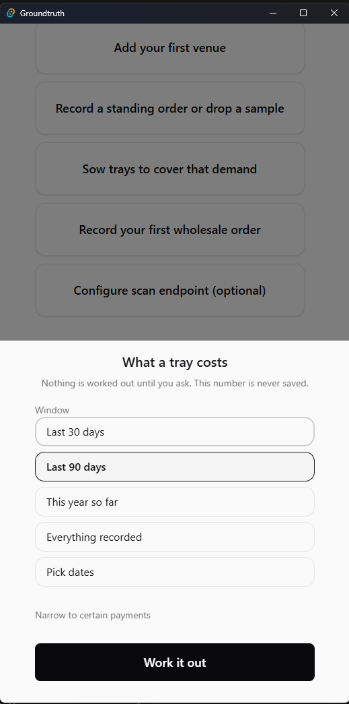
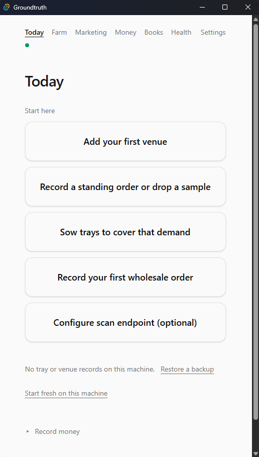
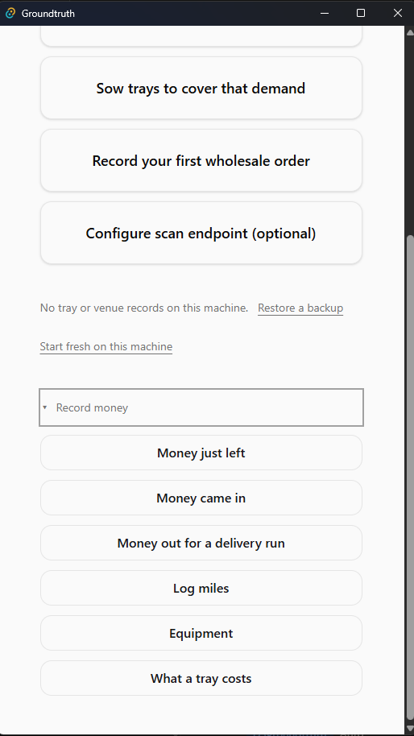
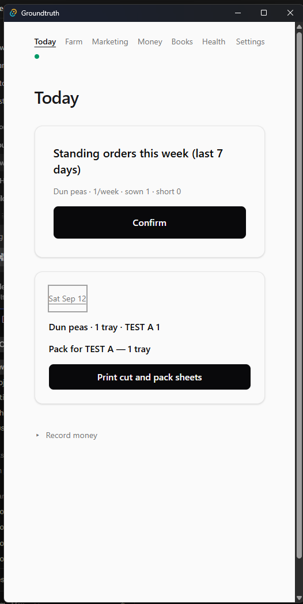

# Today

Today is the ranked queue of what is forced right now. It is not the
shelf (that is Farm), not the register (that is Money), and not a
place to store a second set of numbers. The first live row is the
large card; the rest sit as cards. Receipts sort below every live row.

## If something is wrong

- Health is red and Today still looks calm -> tap **Open Health** on
  the tail card. Do not sow or record money until that check's box is
  followed.
- Cash looks low but Health is green -> you are looking at the Books
  period, not Money unpaid. Do not re-record the payment.
- A collect card is gone but the owed line still names a delivery ->
  you tapped **Not today**. That is one day. Do not mark it Paid on
  Money to hide it.
- The harvest receipt asks leftover ounces and you already listed them
  on Money -> do not press **List leftover** again. One listing per
  crop-day.
- Phone captures sit here and on Farm -> **Accept** here confirms as
  captured. Do not **Accept** here and **Confirm** the same row on
  Farm.
- The queue is empty but you still owe deliveries -> Today says they
  were set aside for today. Do not record a new wholesale order to
  replace them.
- Sow will not close a date the card calls unreachable -> sowing
  cannot reach it. Do not keep pressing **Sow**. Open the order on
  Money.

## Doors on this tab

- **Collect** - writes nothing - opens Money on that unpaid row.
- **Deliver** - writes nothing - opens Money on that ordered row.
- **Sow** - `tray.sown` and `consumption.physical` (seed ounces only
  when you typed a weight) - opens the sow sheet; press **Sow** on
  the sheet to write. Quantity **−** / **+** write nothing.
- **Open the order** - writes nothing - opens Money when sowing
  cannot serve the date.
- **Harvest early** - `trays.harvested` on **Confirm** / **Done** of
  the weight pad - only when that date has trays that can come off
  early.
- **Confirm** (standing-week card) - writes nothing - opens Marketing.
- **Accept** (phone capture) - `phone.proposal_decided` plus
  `trays.advanced` or `trays.harvested` - confirms the captured count
  and weight as they stand. Edit stays on Farm.
- **Discard** (phone capture) - `phone.proposal_decided` - the
  proposal is refused. The tray does not move.
- **Undo** - `undo` - one step, the last reversible write. If nothing
  can reverse it, Today says Nothing to undo.
- **Covered by this harvest** / **Undo mark** - `harvest.covered` -
  a note on the receipt. Not capacity. Not money.
- **List leftover** - `leftover.listed` - ounces from this harvest
  day, once.
- **Gone** - writes nothing - hides the leftover prompt on this
  receipt only.
- **Dismiss** - `attention.resolved` - closes that attention card.
- **Not today** - `attention.resolved` - one-day set-aside on a money
  card. The owed line does not go quiet.
- **Try now** / **Harvest** / **Move to light** / **Open in Stripe**
  (attention extras) - `attention.resolved`, and **Move to light**
  then writes `trays.advanced`; **Harvest** opens the weight pad and
  writes nothing until **Confirm**.
- **Print cut and pack sheets** - writes nothing - prints the cut,
  the venue packs, the run page, and the harvest sentence if a
  harvest receipt is on screen.

- **N more forced right now** - writes nothing - the rest of the live
  queue.
- **Upcoming & later** - writes nothing - deferred attention.
- **Open Health** - writes nothing - opens Health when the tail is
  Unhealthy.
- **Record money** - the six rows below. Same doors on Farm and Money.

- **Money just left** - `cost.money_out` on **Save**.
- **Money came in** - `income.received` on **Save**.

- **Money out for a delivery run** - `cost.money_out` on **Save**.

- **Log miles** - `mileage.trip` on **Save**.

- **Equipment** - `asset.recorded` on **Save**.

- **What a tray costs** - writes nothing - **Work it out** computes;
  the number is never saved.

- **Add your first venue** / **Record a standing order or drop a
  sample** - writes nothing - open Marketing.
- **Sow trays to cover that demand** - same write as **Sow**.
- **Record your first wholesale order** - writes nothing - opens
  Money.
- **Configure scan endpoint (optional)** - writes nothing - opens
  Settings.
- **Restore a backup** - `snapshot.taken` on the farm as it is now,
  then this machine is replaced by that snapshot. Do not merge two
  farms.
- **Start fresh on this machine** - writes nothing - hides the
  recovery line for this session.
- Phone-captures line (**1 phone capture waiting — confirm it on
  Farm.**) - writes nothing - opens Farm.

## Figures

